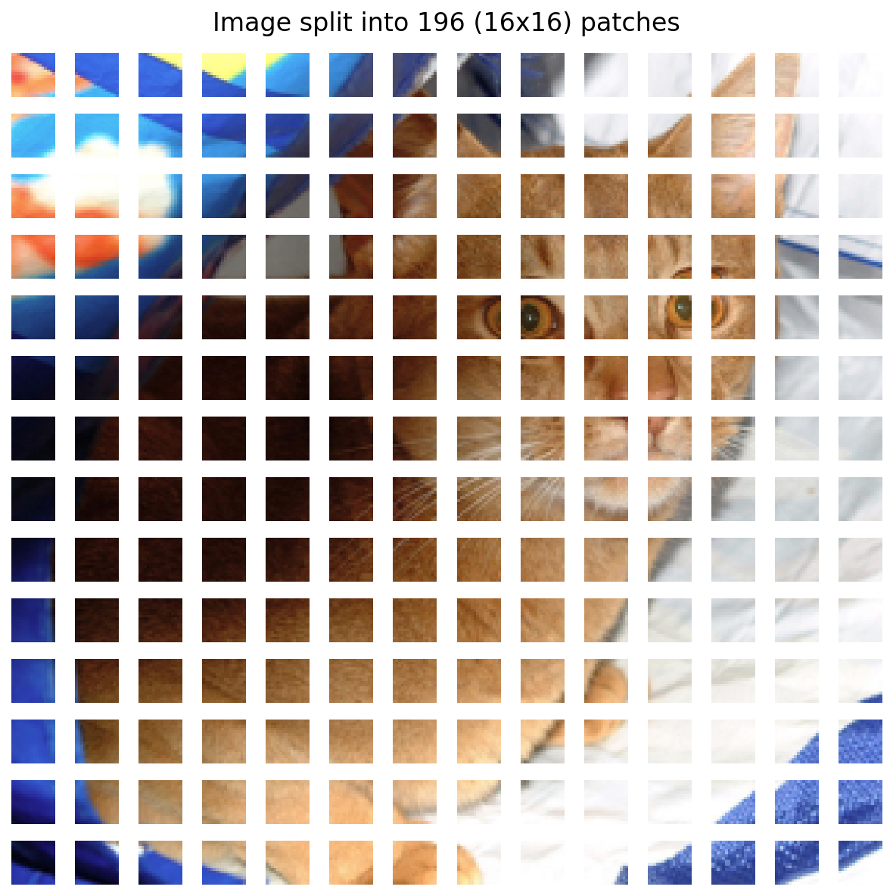
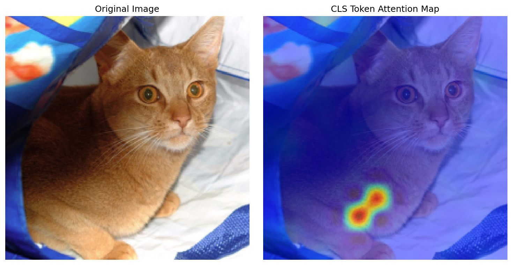
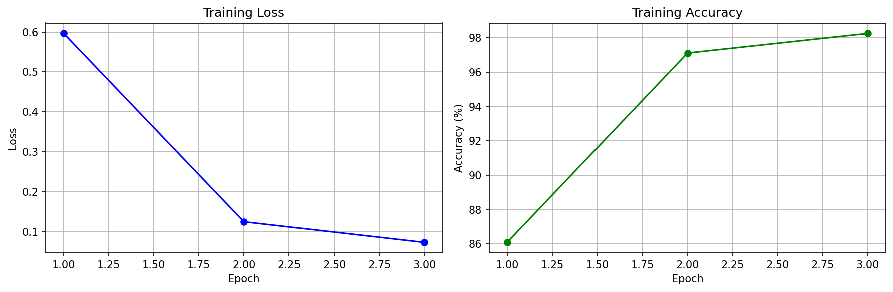
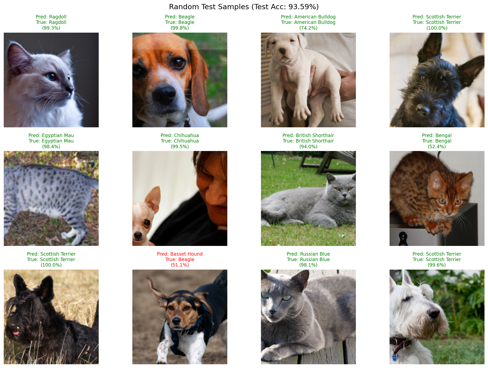

# Classification with the Vision Transformer (ViT)

[](https://www.python.org/)
[](https://pytorch.org/)
[](https://einops.rocks/)

A visual exploration of Vision Transformers using PyTorch and the Oxford-IIIT Pets dataset. 

This project breaks down the architecture step-by-step. It focuses on visualizing intermediate tensor operations—specifically the image "patchification" process and the extraction of self-attention maps to understand the model's decision-making process.

## 📌 Project Highlights
* **Tensor Manipulation:** Uses `einops` for elegant and readable tensor reshaping (converting 2D images into 1D sequence patches).
* **Attention Rollout:** Implements forward hooks to extract and visualize the `[CLS]` token's attention weights across all multi-head self-attention (MHSA) layers.
* **Probabilistic Attention Mapping:** Visualizes the softmax-normalized similarity scores within the attention mechanism, revealing the network's exact spatial focal points.

## Visualizations

### 1. The Patchify Process
Vision Transformers process images as sequences of tokens. Here is how a standard 224x224 image is flattened into 196 patches of 16x16 pixels.


### 2. What is the Model Looking At? (Attention Maps)
By extracting the attention weights from the final layer, we can overlay a heatmap onto the original image to see exactly which features drove the classification.


### 3. Fine-Tuning on Oxford-IIIT Pets
The notebook also demonstrates how to fine-tune the pre-trained ViT for the 37-class pet classification task:
* **Transfer Learning:** Freezes all backbone parameters and replaces only the classification head.
* **Efficient Training:** Trains only the final linear layer using Adam optimizer with cross-entropy loss.
* **Inference:** Shows the model's prediction on a sample image after fine-tuning.



### 4. Test Set Evaluation
After fine-tuning, the model is evaluated on the test set. Below is a grid of sample predictions showing the model's performance across different pet breeds.



## Getting Started

### Prerequisites
1. Clone this repository:
   ```
   git clone https://github.com/DorukKaraman/ViT-Pet-Classification
   cd ViT-Pet-Classification
   ```

2. Create a virtual environment and install dependencies:
    ```
   python -m venv vit
   source vit/bin/activate
   pip install -r requirements.txt
   ```

### Usage

The notebook will automatically download the Oxford-IIIT Pets dataset into a local `data/` directory on the first run.

## Built With
* **[PyTorch](https://pytorch.org/):** Core deep learning framework.
* **[Timm](https://huggingface.co/docs/timm/index):** PyTorch Image Models library for loading the pre-trained `vit_base_patch16_224` weights.
* **[Einops](https://einops.rocks/):** For flexible and readable tensor operations.
* **[OpenCV](https://opencv.org/) & [Matplotlib](https://matplotlib.org/):** For heatmap resizing and visualization.
